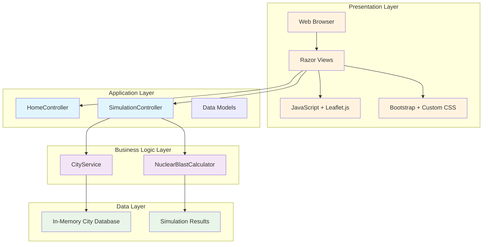
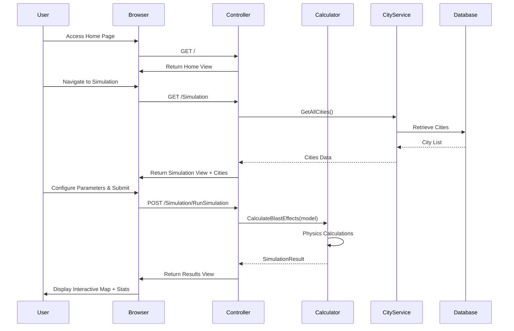
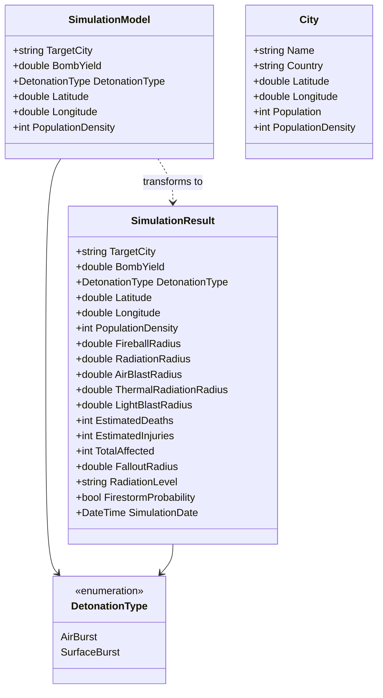
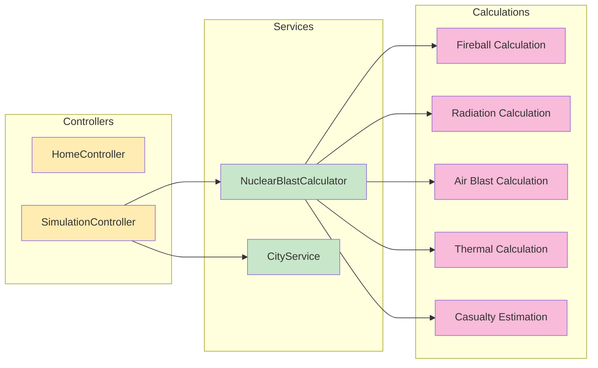
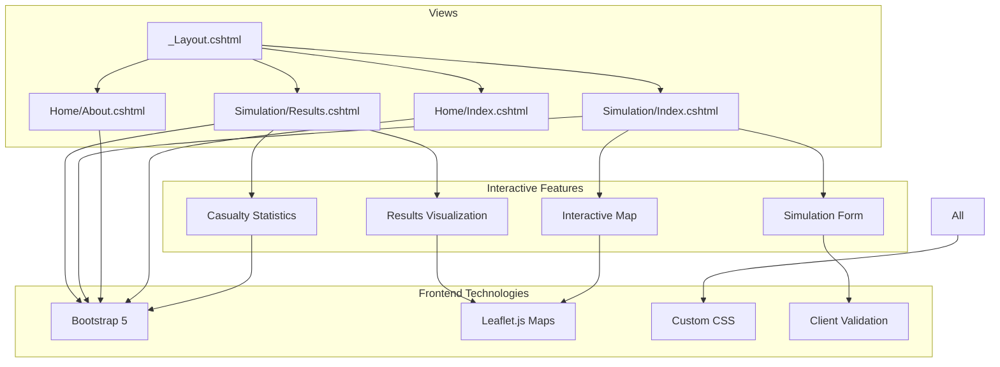
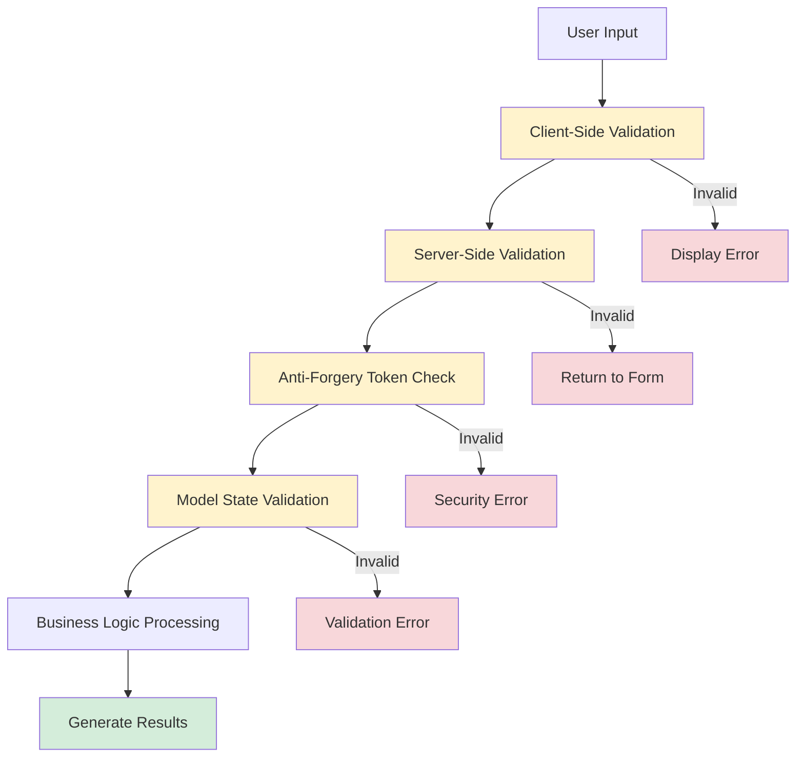

# Nuclear War Simulation - Architecture

## 🏗️ System Architecture

## 🔄 Application Flow

## 📊 Data Model Structure

## 🔧 Service Architecture

## 🌐 Frontend Architecture

## 🔐 Security & Validation Flow

## 📁 Project Structure

```mermaid
graph TD
    Root[Nuclear War Simulation]
    
    Root --> Controllers
    Root --> Models
    Root --> Services
    Root --> Views
    Root --> wwwroot
    Root --> Config[Configuration Files]
    
    Controllers --> HC[HomeController.cs]
    Controllers --> SC[SimulationController.cs]
    
    Models --> SM[SimulationModel.cs]
    Models --> SR[SimulationResult.cs]
    Models --> C[City.cs]
    
    Services --> NBC[NuclearBlastCalculator.cs]
    Services --> CS[CityService.cs]
    
    Views --> Home
    Views --> Simulation
    Views --> Shared
    
    Home --> HI[Index.cshtml]
    Home --> HA[About.cshtml]
    
    Simulation --> SI[Index.cshtml]
    Simulation --> SRes[Results.cshtml]
    
    Shared --> Layout[_Layout.cshtml]
    Shared --> ViewImports[_ViewImports.cshtml]
    Shared --> ViewStart[_ViewStart.cshtml]
    
    wwwroot --> css
    wwwroot --> js
    wwwroot --> lib
    
    Config --> Program[Program.cs]
    Config --> AppSettings[appsettings.json]
    Config --> Project[NuclearWarSimulation.csproj]
```

